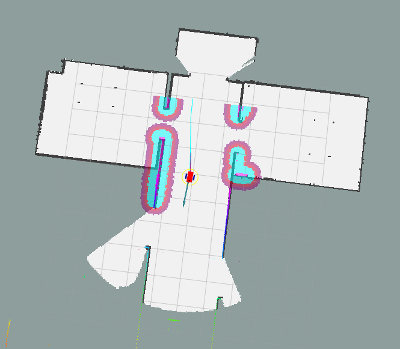
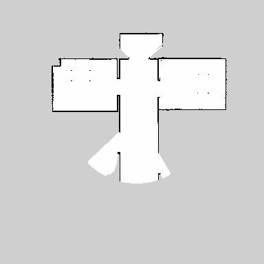
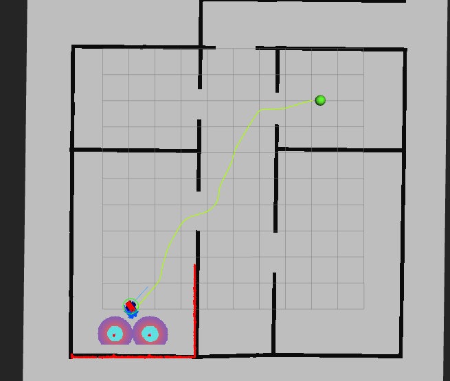
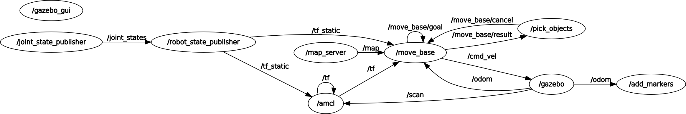
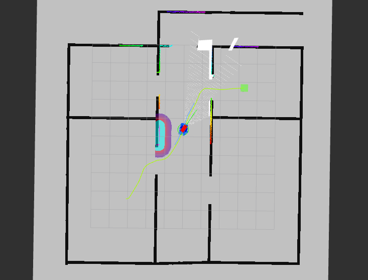
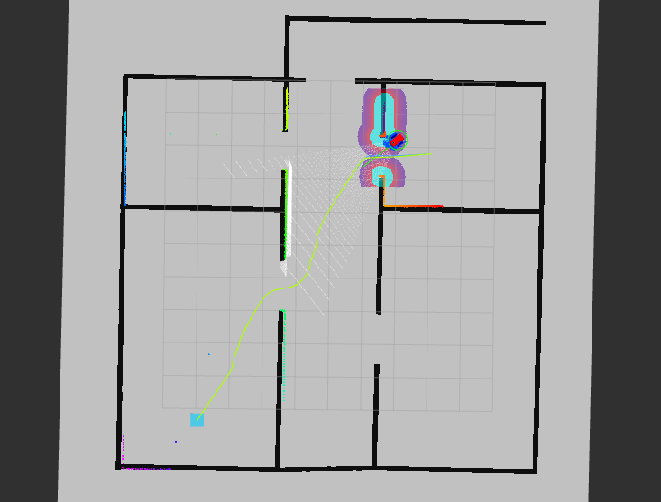

# Final Project:

## SLAM Part

Instructions for SLAM Part:

The following launch files have been created:

* **world.launch**: starts Gazebo with my world (`myworld.world`) and spaws my robot (`my_robot`) ;

  Usage:

  ```bash
  ~$ cd ws_project_7/catkin_ws/
  ~/ws_project_7/catkin_ws$ source devel/setup.bash
  ~/ws_project_7/catkin_ws$ roslaunch my_robot world_robot.launch
  ```

  It takes a while to start and be ready. It produces a screen similar to the one shown in the figure below.
  -2021-05-29T17_50_10.159116.jpg)

  

* **gmapping_demo.launch**: brings up the `slam_gmapping` node.
  Usage:

  ```bash
  ~$ cd ws_project_7/catkin_ws/
  ~/ws_project_7/catkin_ws$ source devel/setup.bash
  ~/ws_project_7/catkin_ws$ roslaunch my_robot gmapping_demo.launch
  ```

  Opens fast. It can be seen at the beginning:

  ```bash
  [ INFO] [1622062729.553880827, 2074.903000000]: Laser is mounted upwards.
   -maxUrange 5 -maxUrange 10 -sigma     0.05 -kernelSize 1 -lstep 0.05 -lobsGain 3 -astep 0.05
   -srr 0.01 -srt 0.02 -str 0.01 -stt 0.02
   -linearUpdate 0.1 -angularUpdate 0.05 -resampleThreshold 0.5
   -xmin -10 -xmax 10 -ymin -10 -ymax 10 -delta 0.05 -particles 40
  [ INFO] [1622062729.555886124, 2074.905000000]: Initialization complete
  update frame 0
  update ld=0 ad=0
  Laser Pose= 0.00199515 0.150008 1.57112
  m_count 0
  Registering First Scan
  
  ```
  
* **view_navigation.launch**: opens RViz and visualizes map being created and sensing operations.
  Usage:

  ```bash
  ~$ cd ws_project_7/catkin_ws/
  ~$ cd ws_project_7/catkin_ws/
  ~/ws_project_7/catkin_ws$ roslaunch my_robot view_navigation.launch
  ```
  
  Alternative usage:
  
  ```bash
  $ rosrun rviz rviz -d ~/ws_project_7/catkin_ws/src/my_robot/rvizConfig/rviz_slam_navigation.rviz
  ```
  
  or
  
  ```bash
  $ rosrun rviz rviz -d /home/fpassold/ws_project_7/catkin_ws/src/my_robot/rvizConfig/rviz_amcl.rviz
  ```
  
  Note: the folder `/rvizConfig`stores some configuration files for RViz.
  
* About **teleop** operation, or some way to manually control the robot via keyboard: it was used the `teleop_twist_keyboard` package.
  Usage:

  ```bash
  ~$ cd ws_project_7/catkin_ws/
  ~/ws_project_7/catkin_ws$ source devel/setup.bash
  ~/ws_project_7/catkin_ws$ rosrun teleop_twist_keyboard teleop_twist_keyboard.py
  ```


To view the map created by the slam_gmapping node, it is necessary to activate the map_server_node by doing:

```bash
~$ cd ws_project_7/catkin_ws/src/maps
~/ws_project_7/catkin_ws/src/maps$ rosrun map_server map_saver -f map_test
[ INFO] [1622063772.632760652]: Waiting for the map
[ INFO] [1622063772.875329694]: Received a 384 X 384 map @ 0.050 m/pix
[ INFO] [1622063772.875412823]: Writing map occupancy data to map_test.pgm
[ INFO] [1622063772.879261414, 3031.359000000]: Writing map occupancy data to map_test.yaml
[ INFO] [1622063772.879775345, 3031.359000000]: Done
~/ws_project_7/catkin_ws/src/maps$
```

This command saves map under current working directory with name specified after `-f` param.

After executing this command you should have two files:

```bash
~/ws_project_7/catkin_ws/src/maps$ ls -lt
total 152
-rw-rw-r-- 1 fpassold fpassold    136 Mai 26 18:16 map_test.yaml
-rw-rw-r-- 1 fpassold fpassold 147508 Mai 26 18:16 map_test.pgm
~/ws_project_7/catkin_ws/src/maps$ 
```

For example:

| RViz screen during exploration:                              | Map generated                                                |
| ------------------------------------------------------------ | ------------------------------------------------------------ |
|  | <br />map_test.yaml:<br />image: map_test.pgm<br/>resolution: 0.050000<br/>origin: [-10.000000, -10.000000, 0.000000]<br/>negate: 0<br/>occupied_thresh: 0.65<br/>free_thresh: 0.196 |

#### Observation:

The launch file **navigation.launch** was created to activate only the ROS navigation stack (node `move_base`), which allows you to work with the “2D Nav Goal” option of RViz -- it is only necessary if the Gazebo and robot were fired using the `world_robot.launch`. 

 Usage:

  ```bash
  ~$ cd ws_project_7/catkin_ws/
  ~$ cd ws_project_7/catkin_ws/
  ~/ws_project_7/catkin_ws$ roslaunch my_robot navigation.launch
  ```

“navigation.launch” accesses several configuration files stored on folder `/src/my_robot/config`, among them are the files:

```
base_local_planner_params.yaml
costmap_common_params.yaml
global_costmap_params.yaml
local_costmap_params.yaml
```

Subsequently, the contents of this launch file were passed to the final section of the robot's launch file used to fire Gazebo and its environment: **world.launch**:
Usage:

```bash
~$ cd ws_project_7/catkin_ws/
~/ws_project_7/catkin_ws$ source devel/setup.bash
~/ws_project_7/catkin_ws$ roslaunch my_robot world.launch
```

### Test SLAM

To simplify the launch of all these nodes, the script file **test_slam.sh** was created.
Usage:

```bash
~$ cd ~/ws_project_7/catkin_ws/src/scripts
~/ws_project_7/catkin_ws/src/scripts$ ./test_slam.sh 
```

Video available in: https://youtu.be/FlMhLDbuTPU 

## Localization Part

It is possible to use the AMCL package to locate the robot more accurately within the previously generated map.

There is also the file **amcl.launch** that activates the AMCL node. 
Usage:

```bash
~$ cd ws_project_7/catkin_ws/
~/ws_project_7/catkin_ws$ source devel/setup.bash
~/ws_project_7/catkin_ws$ roslaunch my_robot amcl.launch
```

Obs.: This launcher requires that the lauch file **word.lauch** has already been activated.

“**amcl.launch**” reads configuration parameters for the AMCL algorithm from the configuration file `../src/my_robot/config/amcl_params.yaml` ans uses as map file, the file **map.yaml** stored on the folder `../src/my_robot/maps/map.yaml`. If someone wants to work with another map file, the yaml file must be indicated in the "Map Server Node" section present within the "amcl.launch" file.

## Navigation Goal Node

Created the "**pick_Objects**" package that establishes 2 points for the robot to move between obeying an interval of 5 seconds after reaching the first point (simulating a collection of material) and before proceeding to the second point (simulating a delivery of material).

There was created the C++ code **pick_objects.cpp** and the **pick_objects.launch** launch file for this node.

The first Build of this package generated messages such as:

```bash
fpassold@ubuntu1:~/ws_project_7/catkin_ws$ catkin_make
...
-- ~~~~~~~~~~~~~~~~~~~~~~~~~~~~~~~~~~~~~~~~~~~~~~~~~
-- ~~  traversing 5 packages in topological order:
-- ~~  - my_robot
-- ~~  - slam_gmapping (metapackage)
-- ~~  - teleop_twist_keyboard
-- ~~  - pick_objects
-- ~~  - gmapping
-- ~~~~~~~~~~~~~~~~~~~~~~~~~~~~~~~~~~~~~~~~~~~~~~~~~
...
[100%] Linking CXX executable /home/fpassold/ws_project_7/catkin_ws/devel/lib/pick_objects/pick_objects
[100%] Built target pick_objects
fpassold@ubuntu1:~/ws_project_7/catkin_ws$
```

To facilitate the use of this package, the script file **pick_objects.sh** was also created.
Usage:

```bash
~$ cd ~/ws_project_7/catkin_ws/src/scripts/
~/ws_project_7/catkin_ws/src/scripts$ ./pick_objects.sh 
```

This script triggers the following nodes:

1. **world.launch**: starts Gazebo with my world (`myworld.world`) and spaws my robot (`my_robot`) 
2. **amcl.launch**: activates the AMCL node (Localization);
3. **navigation.launch**: starts the ROS Navigation stack (move_base node);
4. **rviz**: allows to view the navigation performed. It loads the following configuration file: 
   `src/my_robot/rvizConfig/rviz_amcl.rviz`.
5.  **pick_objects.launch**: triggers the node that simulates a collection and delivery of material.

The video https://youtu.be/3sSG40oFYig  allows to view the pick_objects node in action.

## Simulating Virtual Objects

* Added another package: **add_markers**.
  So far 6 packages:

  ```bash
  -- ~~~~~~~~~~~~~~~~~~~~~~~~~~~~~~~~~~~~~~~~~~~~~~~~~
  -- ~~  traversing 6 packages in topological order:
  -- ~~  - my_robot
  -- ~~  - slam_gmapping (metapackage)
  -- ~~  - teleop_twist_keyboard
  -- ~~  - add_markers
  -- ~~  - pick_objects
  -- ~~  - gmapping
  -- ~~~~~~~~~~~~~~~~~~~~~~~~~~~~~~~~~~~~~~~~~~~~~~~~~
  ```

* Initially created the add_markers node using code that was later renamed to "**add_markers-fade_version.cpp**". This code presents the markers for the pickup and drop off zones as requested in the project, but incorporating a fade-out animation within the 5 seconds they appear in RViz. Unfortunately the idea of this animation is more interesting than the visual effect perceived in RViz. Therefore, this version of the program was abandoned in favor of the next version.

* A **second version of "add_markers.cpp"** was created incorporating an animation that was consisted of using bouncing balls as markers that ascend and descend within the range of 5 seconds. This animation was visually much more satisfying on RViz, as can be seen on YouTube: https://youtu.be/qtNo9dtylf8.
   But at the end of the project, when trying to make this version of add_markers work with odometry data, the whole set didn't work precisely due to problems with the execution of parts of the code intercalated with the animations. Explaining more simply, this code, despite not generating a compilation error or an error during execution, was not able to execute just the routine (call back) that access and uses the odometry data. Reason why, this second version (renamed to “**add_markers-odometry_fail.cpp**”) was abandoned.
   The next figure shows the unwanted result obtained (notice the first marker in the pick up zone, a green ball still "bouncing" while the robot is already in its drop off zone):
   
   The next figure even shows the graph with the active nodes and topics confirming that the add_markers node was connected to the /odom topic:
   

* A **third version of “add_makers.cpp”** was created without any animation and which uses simple squares (low height cubes) with translucency as markers. This version was renamed to "**add_markers_2.cpp**" at the end of the project.
   The next figures show the markers finally adopted:

   | Pickup zone:                                                 | Drop off zone:                                               |
   | ------------------------------------------------------------ | ------------------------------------------------------------ |
   |  |  |

* Created the launch file: **add_markers.launch**.

* Created a RViz config file:
   `.../src/my_robot/rvizConfig/rviz_add_markers.rviz`.

* Created the script file: **add_markers.sh** to brings up the Gazebo with myrobot in myworld and AMCL node, RViz and the node add_makers.
  Usage:

  ```bash
  ~$ cd ~/ws_project_7/catkin_ws/src/scripts/
  ~/ws_project_7/catkin_ws/src/scripts$ ./add_markers.sh 
  ```


## The Service Home Robot

* **add_markers.cpp** and **CMakeList** have been modified to work with odometry data (topic/odom). 
  Note that an attempt was made to work with the "**zones.txt**" file containing data from the pickup and drop off zones, but there was no way to make this part of the code work, that is, the code compiles and executes correctly, but the text file is not found (no matter where it is placed inside the /src folder of this project). Several surveys on ROS forums have been carried out and have pointed out the same difficulty being encountered by others. Without solution. I would have preferred that both add_markers and pick_objects would have been more "flexible", allowing the user to modify the pickup and drop off zones at runtime (with no need to recompile packages).
  The workaround found was to create the header file “**zones.h**” wich define as constants the data of the pickup and drop off zones and duplicate this file in both the /src folder of /add_markers and the /src folder of /pick_objects. This made it a little easier to ensure that the pick up and drop off zones data were the same for both add_markers and pick_objects nodes.

#### Mode of use through launch files:

* **Terminal 1**: **world.launch**: starts Gazebo with my world (`myworld.world`) and spaws my robot (`my_robot`) ;

  ```bash
  ~$ cd ws_project_7/catkin_ws/
  ~/ws_project_7/catkin_ws$ source devel/setup.bash
  ~/ws_project_7/catkin_ws$ roslaunch my_robot world_robot.launch
  ```

  It takes a while to strart and be ready.

* **Terminal 2**: launch AMCL (Localization):

  ```bash
  ~$ cd ws_project_7/catkin_ws/
  ~/ws_project_7/catkin_ws$ source devel/setup.bash
  ~/ws_project_7/catkin_ws$ roslaunch my_robot amcl.launch
  ```

* **Terminal 3**: launch ROS Navigation stack (**move_base** node):

  ```bash
  ~$ cd ws_project_7/catkin_ws/
  ~/ws_project_7/catkin_ws$ source devel/setup.bash
  ~/ws_project_7/catkin_ws$ roslaunch my_robot navigation.launch
  ```

* **Terminal 4**: launch RViz (with appropriate configuration file including display for markers):

  ```bash
  $ rosrun rviz rviz -d /home/fpassold/ws_project_7/catkin_ws/src/my_robot/rvizConfig/rviz_home_service.rviz
  ```

* **Terminal 5**: lauch **add_markers** which shows pickup and drop off zones:

  ```bash
  ~$ cd ws_project_7/catkin_ws/
  ~/ws_project_7/catkin_ws$ source devel/setup.bash
  ~/ws_project_7/catkin_ws$ roslaunch my_robot add_markers.launch
  ```

* **Terminal 6**: launch **pick_objects** that "commands" the robot to the pickup and drop off zones:

  ```bash
  ~$ cd ws_project_7/catkin_ws/
  ~/ws_project_7/catkin_ws$ source devel/setup.bash
  ~/ws_project_7/catkin_ws$ roslaunch my_robot pick_objects.launch
  ```
  
  This final result can be seen in: https://youtu.be/yBRJ4_RfraI


#### Mode use with only 1 script file

* Created the script file: **home_service.sh** to brings up the Gazebo with myrobot in myworld and AMCL node, RViz and the node add_makers.
  Usage:

  ```bash
  ~$ cd ~/ws_project_7/catkin_ws/src/scripts/
  ~/ws_project_7/catkin_ws/src/scripts$ ./home_service.sh 
  ```

The final result can be seen on YouTube: https://youtu.be/-AlIbPCiigY


---

Fernando Passold, last update 05.06.2021

